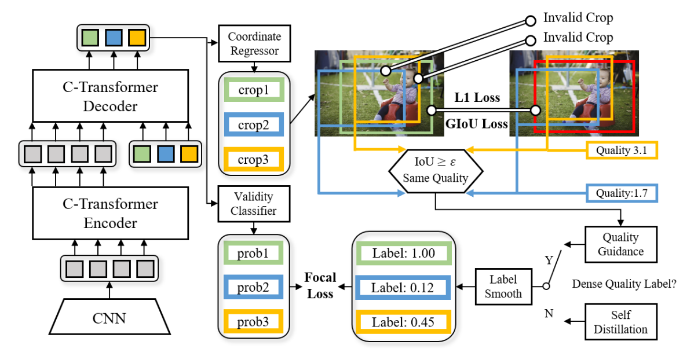

# RethinkingImageCropping-Paddle (CVPR 2022)
PaddlePaddle Implementation of "Rethinking Image Cropping: Exploring Diverse Compositions from Global Views"

[[CVPR2022]([https://arxiv.org/abs/2211.11167](https://openaccess.thecvf.com/content/CVPR2022/html/Jia_Rethinking_Image_Cropping_Exploring_Diverse_Compositions_From_Global_Views_CVPR_2022_paper.html))]

###  Introduction

Existing image cropping works mainly use anchor evaluation methods or coordinate regression methods. However, it is difficult for pre-defined anchors to cover good crops globally, and the regression methods ignore the cropping diversity. In this paper, we regard image cropping as a set prediction problem. A set of crops regressed from multiple learnable anchors is matched with the labeled good crops, and a classifier is trained using the matching results to select a valid subset from all the predictions. This new perspective equips our model with globality and diversity, mitigating the shortcomings but inherit the strengthens of previous methods. Despite the advantages, the set prediction method causes inconsistency between the validity labels and the crops. To deal with this problem, we propose to smooth the validity labels with two different methods. The first method that uses crop qualities as direct guidance is designed for the datasets with nearly dense quality labels. The second method based on the self distillation can be used in sparsely labeled datasets. Experimental results on the public datasets show the merits of our approach over state-of-the-art counterparts.

### Citation
	 @InProceedings{Jia_2022_CVPR,
       author    = {Jia, Gengyun and Huang, Huaibo and Fu, Chaoyou and He, Ran},
       title     = {Rethinking Image Cropping: Exploring Diverse Compositions From Global Views},
       booktitle = {Proceedings of the IEEE/CVF Conference on Computer Vision and Pattern Recognition (CVPR)},
       month     = {June},
       year      = {2022},
       pages     = {2446-2455}
       }
